# Tladi-AWS-Projects

Design and Deploy a Secure AWS VPC Infrastructure

This repository contains diagrams and screenshots for designing and deploying a secure VPC on AWS. The images below are stored in the folder `Design and Deploy a Secure AWS VPC Infrastructure`.

## Architecture diagrams and settings

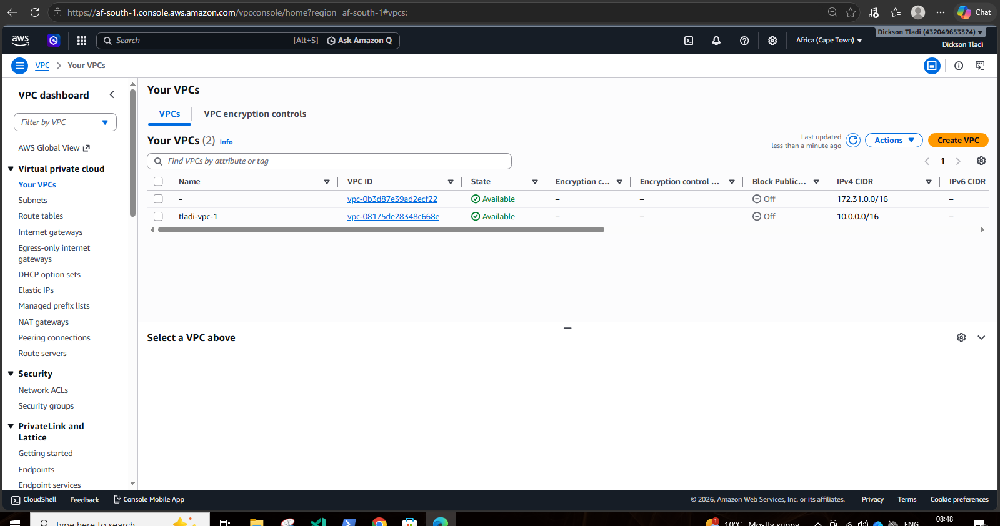

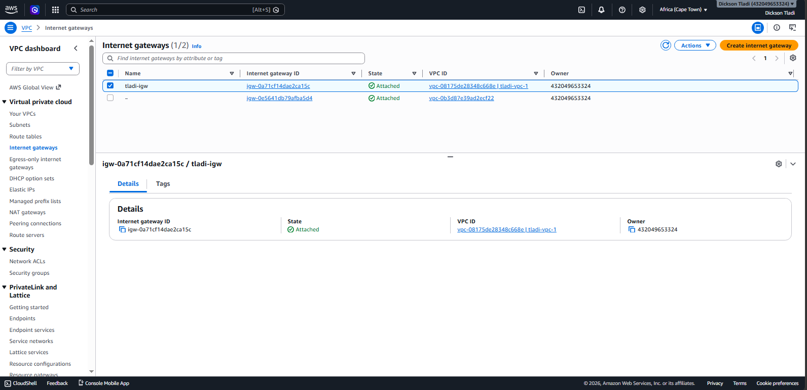

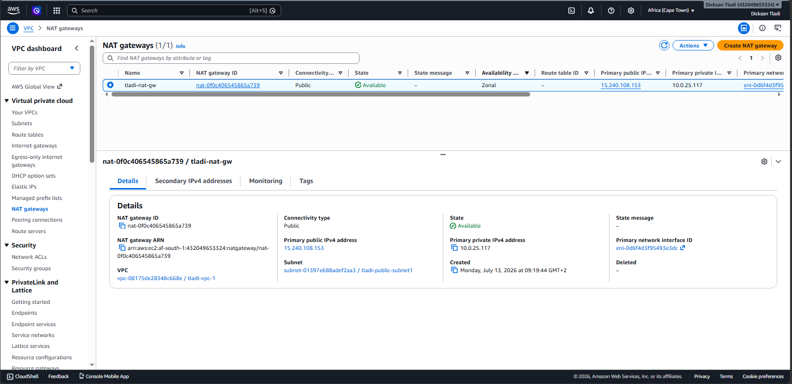

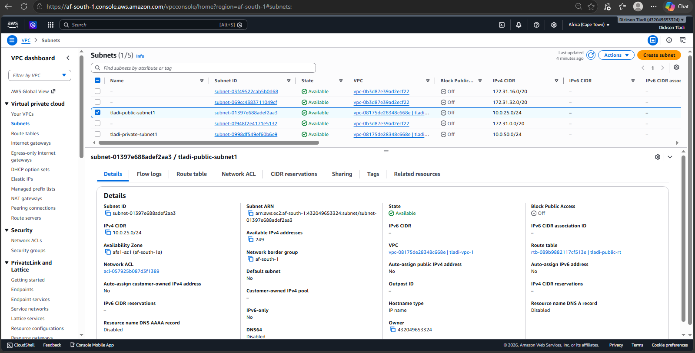

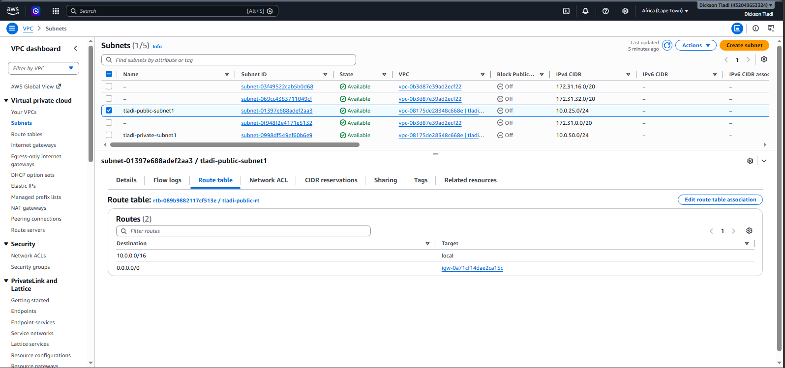

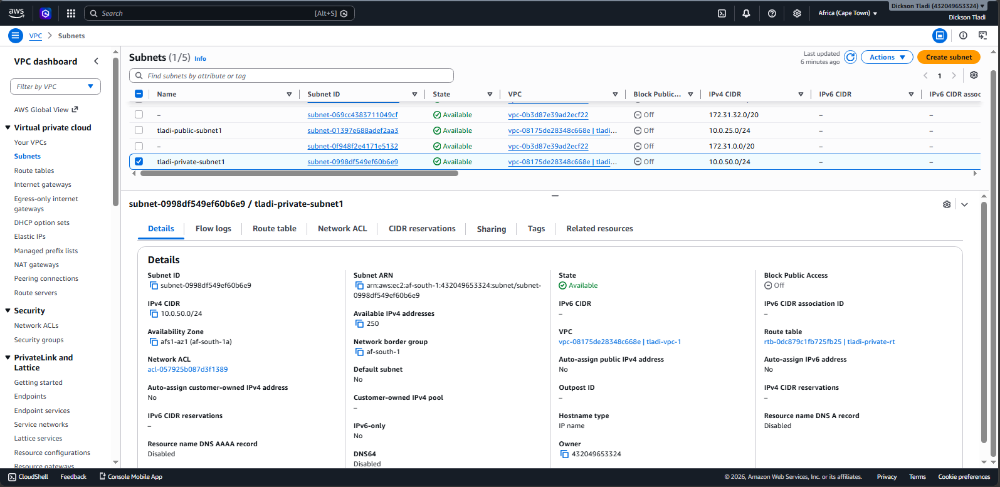

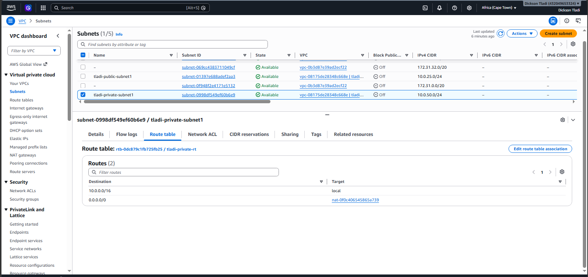

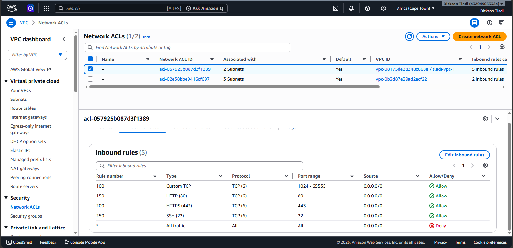

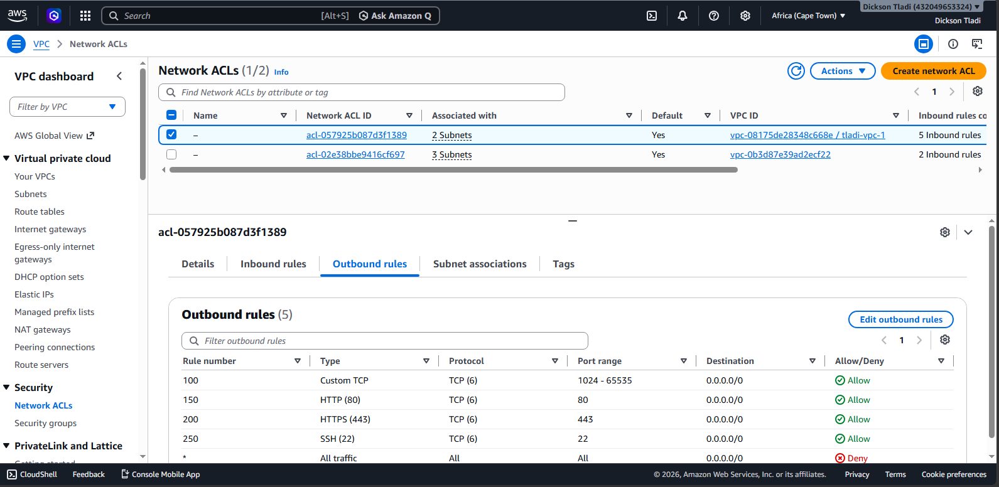

## Instance access and security group settings

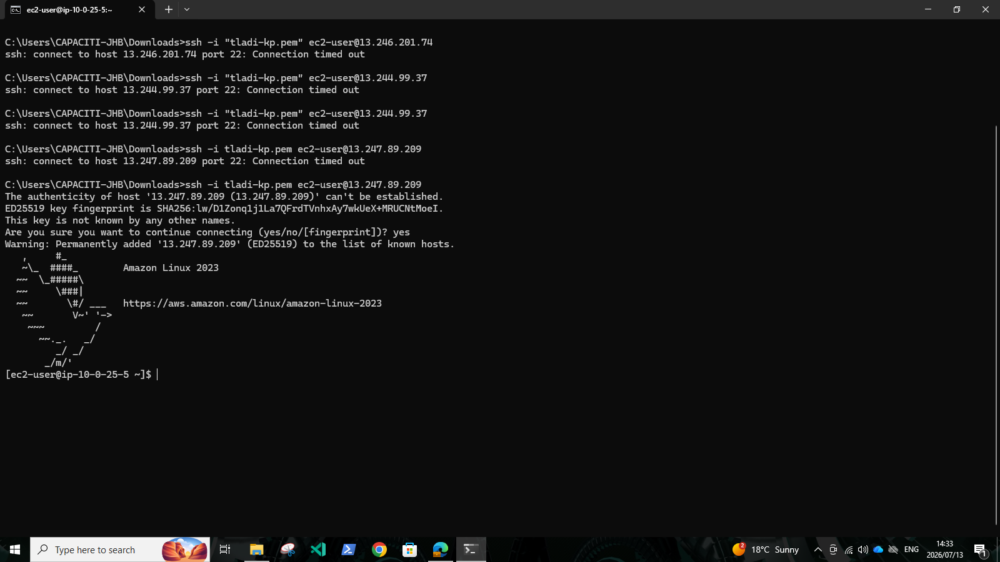

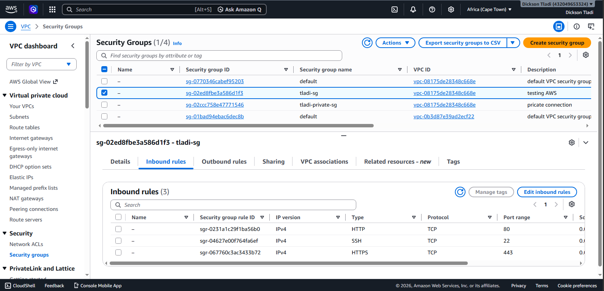

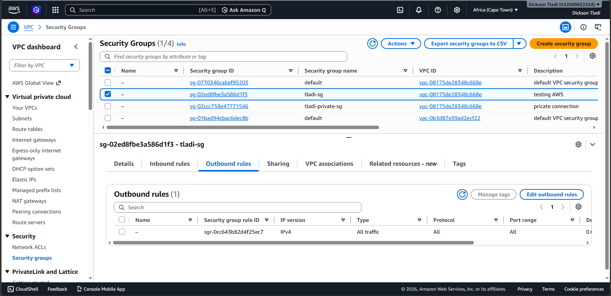

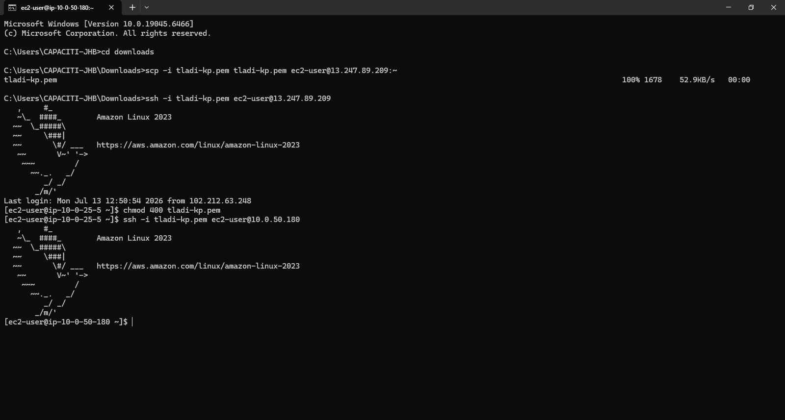

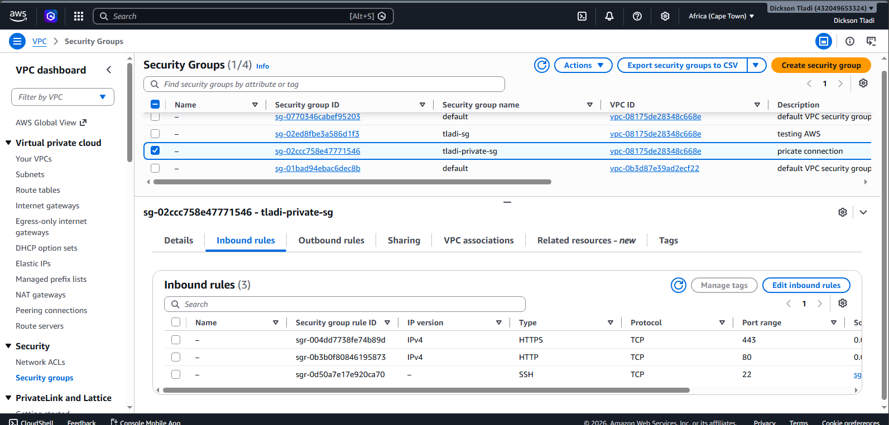

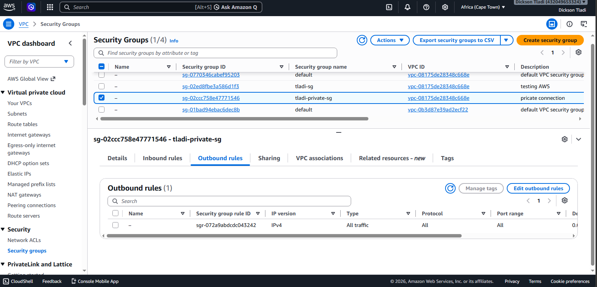

